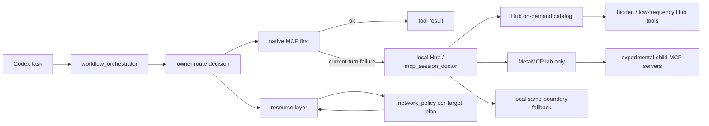

# Codex Network Gateway Direction B Draft

Status: archived isolated lab experiment and capability reference, not active runtime integration.
Owner surface: `_bridge/network_policy.py`, `_bridge/network_doctor.py`, `_bridge/local_mcp_hub.py`, `_bridge/mcp_session_doctor.py`, `_bridge/resource_cli.py`.
Non-goals: no install, no system proxy mutation, no DNS mutation, no Clash node switching, no secret migration, no replacement of native MCP priority.
Validation owner: network doctor, Hub validate/smoke, MCP session doctor, resource fetcher tests.

## Decision

Do not use MetaMCP as the practical Codex gateway. Keep it as an isolated experiment and capability reference. The practical route is the existing local Hub with stable core tools plus on-demand `hub.catalog` / `hub.search` / `hub.describe` / `hub.call`. A true global Codex network gateway remains a separate future design track.

This direction is now an isolated test environment track. It must not be wired into the active Codex runtime. The current machine keeps native MCP first, current Hub second when it owns the route or native current-turn callability fails, and bounded local fallback last.

## External Evidence

MetaMCP is relevant because it is designed as an MCP proxy/aggregator that can combine servers into a unified MCP server, with namespaces, endpoints, middleware, tool overrides, annotations, and Docker-based deployment. Its docs show MCP server configuration around command, arguments, environment, server type, authentication, and dependencies. Its quick start currently assumes Docker/Docker Compose, PostgreSQL, browser dashboard access, and explicit production secret/HTTPS hardening.

`acehoss/mcp-gateway` is relevant because it bridges stdio MCP servers to HTTP+SSE and REST API, supports multiple server instances, session IDs, YAML config, optional Basic/Bearer auth, and resource cleanup. Its repository is much smaller and explicitly warns that issues and PRs may languish, so it is better as a reference implementation than as the long-term center of this machine.

Reference sources:

- https://github.com/metatool-ai/metamcp
- https://docs.metamcp.com/en/concepts/mcp-servers
- https://docs.metamcp.com/en/quickstart
- https://github.com/acehoss/mcp-gateway
- https://github.com/acehoss/mcp-gateway/blob/main/config.yaml
- https://github.com/e2b-dev/awesome-mcp-gateways

## Fit To Current Machine

Current local facts:

- The network layer is advisory and per-target. It detects `http://127.0.0.1:7897` as a candidate proxy but does not bind all traffic to it.
- Hub already exposes read-only network tools and governed MCP gateway tools.
- MCP stability rules distinguish service health from active Codex turn exposure and callability.
- Resource acquisition can call owner tools and attach receipts, but it must not bypass owner permissions.
- The user prefers stable infrastructure, hidden/no-popup operation, root-cause diagnosis, and no functionality reduction for speed.

Direction B must therefore act as an experiment and design reference, not a forced traffic proxy or production control plane. Its useful lessons are absorbed into Hub on-demand discovery and future network-gateway design while preserving direct native MCP as the preferred route.

## Architecture Target



MetaMCP should not sit on the practical route. Codex should treat it as a lab-only reference for child MCP inventory, namespace composition, tool metadata normalization, and endpoint experiments. Practical token reduction and stable routing are owned by Hub on-demand catalog/search/describe/call.

## Role Split

| Layer | Current owner | Direction B role |
|---|---|---|
| Native MCP | Codex tool surface | Remains first choice when current-turn callable |
| Local Hub | `_bridge/local_mcp_hub.py` | Keeps stable aliases, low-risk route tools, and governed gateway calls |
| MCP session doctor | `_bridge/mcp_session_doctor.py` | Records negative current-turn evidence before gateway use |
| Hub on-demand catalog | `_bridge/local_mcp_hub_catalog.py` | Keeps default tools/list small and expands hidden tools only when needed |
| MetaMCP draft | Isolated lab only | Aggregates selected child MCPs for experiments; not a practical default route |
| acehoss/mcp-gateway draft | Reference only | Compare transport bridging, REST/SSE exposure, session cleanup |
| Network layer | `_bridge/network_policy.py` | Gives per-target route advice; does not mutate global proxy/DNS |
| Resource layer | `_bridge/resource_cli.py` | Requests resources and records receipts; calls owner tools under boundaries |

## Adoption Plan

### Phase 0: Design Inventory

Create a machine-readable candidate inventory only after separate approval:

- candidate service: MetaMCP
- comparison service: acehoss/mcp-gateway
- local child MCP candidates: CodeGraph, Context7, Microsoft Docs, GitHub, Chrome DevTools, PMB, desktop-weixin, mobile bridge
- excluded first-pass children: tools requiring high-risk writes, secrets, external message sending, or unstable visible windows

Output should be a small JSON draft under `_bridge/runtime/`, optimized for Codex routing rather than human reading.

### Phase 1: Isolated Lab

Run MetaMCP only in an isolated local lab:

- separate port range
- localhost binding only
- no Windows startup task
- no Codex config registration
- no copied secrets
- one or two read-only child MCPs first
- explicit smoke checks for tools/list and a harmless tools/call

Success means the service can start, list child tools, call a read-only tool, stop cleanly, and leave no orphan process fanout.

### Phase 2: Boundary Mirror

Map current local boundaries into MetaMCP namespaces:

- `readonly.docs`: Context7, Microsoft Docs
- `readonly.code`: CodeGraph read-only exploration
- `readonly.state`: SQLite read-only inspection where allowed
- `guarded.browser`: browser/devtools read-only first, action tools separate
- `guarded.bridge`: mobile/Weixin bridge only with existing ack/result and permission contracts

Do not add GitHub write, Weixin send, filesystem-admin, secret access, or database writes until each has an owner-specific approval and validation route.

### Phase 3: Hub On-Demand Absorption

Absorb the useful gateway idea into local Hub itself:

- `hub.catalog`
- `hub.search`
- `hub.describe`
- `hub.call`

The Hub remains the Codex-facing stable entry. Hidden or low-frequency Hub tools are discovered, described, and called on demand. MetaMCP lab tools stay hidden from default `tools/list`; a MetaMCP outage must not affect native MCP use or Hub core tools.

### Phase 4: Controlled Expansion

Promote child MCPs one by one:

1. read-only documentation MCPs
2. read-only source/codegraph MCPs
3. read-only structured state MCPs
4. low-risk browser/devtools readbacks
5. guarded write-capable tools only after separate approval

Each promotion needs:

- native route still works or has known failure classification
- gateway route works
- same-boundary fallback exists
- no secret leakage in logs
- no visible popup regression
- restart/Codex-restart behavior tested

## MetaMCP Strengths To Absorb

- Namespace composition: useful for grouping many MCPs without exposing every tool at once.
- Tool overrides and annotations: useful for making tool descriptions and read/write hints clearer to Codex.
- Endpoint model: useful for lab/testing and future stable Hub-to-gateway calls.
- Dashboard/inspection: useful for human diagnosis, but not required in the normal Codex path.
- Server config model: useful for explicit command, args, env, and dependency ownership.

## MetaMCP Risks

- Docker/PostgreSQL adds startup cost and another service lifecycle.
- Dashboard/signup/auth can introduce unnecessary complexity for a single-user local machine.
- CORS/APP_URL and secret settings can create confusing local failures if copied casually.
- Cold starts may worsen Codex restart time if placed on the recovery critical path.
- Namespace aggregation can hide owner boundaries if tool names are flattened carelessly.
- A gateway cannot prove native current-turn callability; it only proves continuity.

Mitigation: keep MetaMCP out of Codex startup and session recovery critical paths until it passes isolated lab validation.

## acehoss/mcp-gateway Strengths To Absorb

- Simpler transport bridge from stdio MCP to HTTP/SSE.
- YAML server config is easy to diff and review.
- Session ID model is a useful reference for isolating multiple instances.
- REST/OpenAPI-style access can help non-MCP consumers or diagnostics.

## acehoss/mcp-gateway Limits

- Small project footprint and limited commit history.
- Less suitable as long-term control plane.
- More transport-focused than policy/namespace/tool-governance focused.
- Should not become the main infrastructure unless MetaMCP proves too heavy.

## Hard Boundaries

- Do not replace native MCP priority.
- Do not register MetaMCP as a required Codex startup dependency.
- Do not move secrets into MetaMCP until the local secret vault is mature and the consuming tool is approved.
- Do not use gateway success as proof that native current-turn MCP is healthy.
- Do not route write-capable tools through a generic gateway without owner-specific approval and readback validation.
- Do not add OAuth/RBAC/multi-tenant complexity just because MetaMCP supports it.
- Do not expose non-local ports before an explicit network/security review.

## Isolated Lab Entry

Use `_bridge/gateway_lab.py` for experiments:

```powershell
python _bridge\gateway_lab.py init
python _bridge\gateway_lab.py fetch --candidate metamcp
python _bridge\gateway_lab.py fetch --candidate acehoss-mcp-gateway
python _bridge\gateway_lab.py doctor
```

The lab writes only under `_bridge/runtime/gateway-lab` by default. It does not edit Codex config, register MCP tools, mutate proxy/DNS, install startup tasks, or move secrets.

### Verified Lab Status On 2026-07-06

Docker Desktop and WSL2 are available, but this Codex session was running with an administrator token. Direct `docker pull` from the elevated Codex process failed because Docker credential helpers (`docker-credential-desktop` / `docker-credential-wincred`) could not access the Windows credential vault and returned `A specified logon session does not exist`.

The practical fix for the lab is not to remove Docker features or weaken Docker Desktop. The lab uses a hidden, one-shot scheduled task with the same Windows user and `RunLevel Limited` for Docker pull/compose operations:

```powershell
python _bridge\gateway_lab.py docker-limited-pull --image postgres:16-alpine
python _bridge\gateway_lab.py metamcp-compose --action pull
python _bridge\gateway_lab.py metamcp-compose --action up
python _bridge\gateway_lab.py metamcp-compose --action ps
python _bridge\gateway_lab.py metamcp-status
python _bridge\gateway_lab.py metamcp-bootstrap-lab --confirm
python _bridge\gateway_lab.py metamcp-install-echo --confirm
python _bridge\gateway_lab.py metamcp-smoke
python _bridge\gateway_lab.py metamcp-compose --action down
```

The one-shot task is deleted after each command. This preserves the user's Docker Desktop configuration and avoids visible PowerShell/CMD windows during ordinary lab work.

MetaMCP has been validated as an isolated lab service with:

- app container healthy on `127.0.0.1:12008`;
- Postgres container healthy on `127.0.0.1:9433`;
- HTTP `200` from `http://127.0.0.1:12008`;
- public endpoint list exposed at `http://127.0.0.1:12008/metamcp`;
- lab-only `Lab` namespace and `lab-public` endpoint created in the isolated MetaMCP Postgres database;
- lab-only `lab_echo` STDIO MCP server registered in the isolated MetaMCP Postgres database;
- streamable HTTP MCP `initialize`, `tools/list`, and `tools/call` verified through `http://127.0.0.1:12008/metamcp/lab-public/mcp`;
- `tools/list` returned `lab_echo__echo`;
- `tools/call` returned `gateway-lab-ok`;
- no Codex config edits, MCP registration, startup task, proxy/DNS mutation, or secret migration.

The lab has also validated a real read-only child MCP behind MetaMCP:

```powershell
python _bridge\gateway_lab.py metamcp-install-context7 --confirm
python _bridge\gateway_lab.py metamcp-smoke-context7
```

Context7 validation evidence:

- registered lab-only `context7_docs` with command `npx` and args `-y @upstash/context7-mcp@3.2.3`;
- `metamcp-status` now lists both lab-mapped servers: `lab_echo` and `context7_docs`;
- `tools/list` through `http://127.0.0.1:12008/metamcp/lab-public/mcp` returned `lab_echo__echo`, `context7_docs__resolve-library-id`, and `context7_docs__query-docs`;
- `context7_docs__resolve-library-id` was called through the MetaMCP endpoint with `libraryName=React`;
- the call returned Context7 React library candidates including `/reactjs/react.dev`;
- Context7 smoke is read-only and remains inside the isolated lab. It does not register MetaMCP into Codex, copy secrets, change network settings, or alter native MCP priority.

Two lab harness fixes came out of this validation:

- long SSE bodies must be preserved internally for parsing and compacted only in command output;
- protocol smoke must allow slower `tools/list` when a namespace contains real cold-start child MCPs, not only the in-memory echo server.

### Hub-Facing Lab Adapter

The lab now has a Hub-facing adapter, still isolated from production:

```powershell
python _bridge\local_mcp_hub.py validate
```

Hub exposes five experimental lab tools:

- `metamcp_lab.catalog`
- `metamcp_lab.search`
- `metamcp_lab.describe`
- `metamcp_lab.call_readonly`
- `metamcp_lab.validate`

This is the first practical version of the low-token gateway pattern:

- `catalog` returns compact server/tool metadata instead of dumping every child MCP schema;
- `search` narrows the catalog before schema expansion;
- `describe` expands exactly one child tool schema on demand;
- `call_readonly` calls only tools that advertise `readOnlyHint=true` and requires `gateway-lab-readonly-and-production-native-first`;
- `validate` checks the adapter and reports child tool count plus network metadata.

The running Hub service was reloaded through the existing hidden `CodexLocalMcpHub` task. The reload only stopped the process whose command line matched `local_mcp_hub.py serve --port 18881`, then restarted the same scheduled task. It did not register MetaMCP as a production Codex MCP and did not put MetaMCP on the startup critical path.

Validation evidence:

- `python _bridge\local_mcp_hub.py validate` returned `ok=true` with 98 tools;
- HTTP MCP `tools/call` to `metamcp_lab.validate` returned `ok=true`;
- `metamcp_lab.call_readonly` successfully called `context7_docs__resolve-library-id` and returned React library candidates;
- `metamcp-smoke` and `metamcp-smoke-context7` still pass after the adapter work.

### Per-Child Network Environment

The experiment now explicitly keeps the original network-gateway goal: each child MCP can carry its own runtime network environment.

For `context7_docs`, the lab installer calls `_bridge/network_policy.py` through `env_for_runtime(..., runtime="npx")` and writes the resulting per-process environment into the MetaMCP server row. The current Context7 child metadata includes:

- `CODEX_NETWORK_PROFILE=package_auto`
- `CODEX_NETWORK_ROUTE=auto_fastest`
- `CODEX_NETWORK_TARGET=https://registry.npmjs.org/@upstash/context7-mcp`
- proxy variables for the child process only, not global system proxy settings.

A Docker-specific pitfall was found and fixed. The network layer detected the host proxy as `http://127.0.0.1:7897`, but a MetaMCP child runs inside a Docker container, where `127.0.0.1` means the container itself. The lab now rewrites host-local proxy URLs to `host.docker.internal` for Docker child MCPs:

- host process route: `http://127.0.0.1:7897`
- Docker child route: `http://host.docker.internal:7897`

Container probes confirmed `host.docker.internal:7897` is reachable while container `127.0.0.1:7897` is not. This is now part of the Context7 lab child env as `CODEX_NETWORK_CONTAINER_PROXY_REWRITE=host.docker.internal`.

The upstream compose file originally exposed ports on `0.0.0.0`. The lab clone was constrained to `127.0.0.1` before keeping the service running.

One upstream-image caveat was found: the running `ghcr.io/metatool-ai/metamcp:latest` image received the expected `BOOTSTRAP_*` environment variables, but did not execute the environment bootstrap path shown in the local source checkout. The lab therefore uses explicit, idempotent lab-only SQL bootstrap commands for namespace, endpoint, and echo server setup. This is acceptable for the isolated lab, but production integration should not rely on unverified bootstrap behavior.

The first echo-server attempt exposed a useful protocol pitfall: MCP JSON-RPC request IDs may be `0`; a child server must not drop `id: 0` by checking `if (!id)`. The lab echo server now ignores only `undefined`/`null` IDs.

## First Integration Proposal

Only after a new approval, implement:

1. `_bridge/gateway_candidate_inventory.py`
   - read-only snapshot/validate for candidate gateway projects and local child MCP profiles
   - no process start
   - no config mutation

2. `_bridge/docs/codex_network_gateway_direction_b_draft.md`
   - this draft remains the human-readable control document

3. `_bridge/runtime/gateway_candidate_inventory.json`
   - generated machine-first route data for Codex

4. Validation
   - `python _bridge\gateway_candidate_inventory.py validate`
   - `python _bridge\local_mcp_hub.py validate`
   - `python _bridge\mcp_session_doctor.py validate`
   - `python _bridge\network_doctor.py validate`

## Current Verdict

Do not proceed with MetaMCP as the main candidate for practical routing. Preserve the lab and its evidence as a reference. Invest practical work into Hub on-demand exposure and the later true global network gateway.

Use acehoss/mcp-gateway as the lightweight transport baseline and a fallback design reference, not as the primary architecture.
